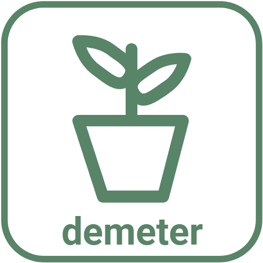

<!-- PROJECT SHIELDS -->
<!--
*** I'm using markdown "reference style" links for readability.
*** Reference links are enclosed in brackets [ ] instead of parentheses ( ).
*** See the bottom of this document for the declaration of the reference variables
*** for contributors-url, forks-url, etc. This is an optional, concise syntax you may use.
*** https://www.markdownguide.org/basic-syntax/#reference-style-links
-->
[![Contributors][contributors-shield]][contributors-url]
[![Forks][forks-shield]][forks-url]
[![Stargazers][stars-shield]][stars-url]
[![Issues][issues-shield]][issues-url]
[![MIT License][license-shield]][license-url]
[![LinkedIn][linkedin-shield]][linkedin-url]


<!-- PROJECT LOGO -->
<br />
<div align="center">
  <a href="https://github.com/realcadecon/demeter">
    
  </a>

  <h3 align="center">Project Demeter</h3>

  <p align="center">
    Making healthy eating and zero-waste grocery shopping accessible to all!
    <br />
    <a href="https://github.com/realcadecon/demeter"><strong>Explore the docs »</strong></a>
    <br />
    <br />
    <a href="https://github.com/realcadecon/demeter">View Demo</a>
    ·
    <a href="https://github.com/realcadecon/demeter/issues">Report Bug</a>
    ·
    <a href="https://github.com/realcadecon/demeter/issues">Request Feature</a>
  </p>
</div>


<!-- TABLE OF CONTENTS -->
<details>
  <summary>Table of Contents</summary>
  <ol>
    <li>
      <a href="#about-the-project">About The Project</a>
      <ul>
        <li><a href="#built-with">Built With</a></li>
      </ul>
    </li>
    <li>
      <a href="#getting-started">Getting Started</a>
      <ul>
        <li><a href="#prerequisites">Prerequisites</a></li>
        <li><a href="#installation">Installation</a></li>
      </ul>
    </li>
    <li><a href="#usage">Usage</a></li>
    <li><a href="#roadmap">Roadmap</a></li>
    <li><a href="#contributing">Contributing</a></li>
    <li><a href="#license">License</a></li>
    <li><a href="#contact">Contact</a></li>
    <li><a href="#acknowledgments">Acknowledgments</a></li>
  </ol>
</details>


<!-- ABOUT THE PROJECT -->
## About The Project

[![product-screenshot]](https://example.com)

There are many great apps that enable you to eat healthy, make grocery shopping easier, or help you live a more environment-friendly lifestyle. I built this app to accomplish all three!

Here's why:
* Eating healthy is hard enough as is. It takes lots of effort to learn which foods to eat, how much to eat, how to cook such food, and how to turn all this effort into a sustainable habit. :muscle:
* Eating healthy can be expensive! The last thing you want to do after buying increasingly expensive groceries is to throw out unused food. :moneybag:
* Planning, Cooking, Eating, and Grocery Shopping takes a lot of time! If only you could accomplish all these tasks making more time for things in life that matter- Gen AI. (todo -change) :smile:

Of course, no app is 100% complete and bug free. You may also suggest changes by forking this repo and creating a pull request or opening an issue. Thanks to all the people have and will contribute to this app!

<p align="right">(<a href="#readme-top">back to top</a>)</p>

### Built With

This section should list any major frameworks/libraries used to bootstrap your project. Leave any add-ons/plugins for the acknowledgements section. Here are a few examples.

* [![Spring][Spring-badge]][Spring-url]
* [![SpringBoot][SpringBoot-badge]][SpringBoot-url]
* [![Bootstrap][Bootstrap.com]][Bootstrap-url]
* [![Thymeleaf][Thymeleaf-badge]][Thymeleaf-url]
* [![MySQL][MySQL-badge]][MySQL-url]
* [![Java][Java-badge]][Java-url]
* [![HTML5][HTML-badge]][HTML-url]

<p align="right">(<a href="#readme-top">back to top</a>)</p>


<!-- GETTING STARTED -->
## Getting Started (TODO: UPDATE SECTION)

This is an example of how you may give instructions on setting up your project locally.
To get a local copy up and running follow these simple example steps.

### Prerequisites

This is an example of how to list things you need to use the software and how to install them.
* npm
  ```sh
  npm install npm@latest -g
  ```

### Installation

_Below is an example of how you can instruct your audience on installing and setting up your app. This template doesn't rely on any external dependencies or services._

1. Get a free API Key at [https://example.com](https://example.com)
2. Clone the repo
   ```sh
   git clone https://github.com/your_username_/Project-Name.git
   ```
3. Install NPM packages
   ```sh
   npm install
   ```
4. Enter your API in `config.js`
   ```js
   const API_KEY = 'ENTER YOUR API';
   ```

<p align="right">(<a href="#readme-top">back to top</a>)</p>


<!-- USAGE EXAMPLES -->
## Usage

Use this space to show useful examples of how a project can be used. Additional screenshots, code examples and demos work well in this space. You may also link to more resources.

_For more examples, please refer to the [Documentation](https://example.com)_

<p align="right">(<a href="#readme-top">back to top</a>)</p>


<!-- ROADMAP -->
## Roadmap

- [x] Build CRUD Features 
- [ ] Rework Database Entities 
- [ ] Connect to USDA database
- [ ] Update UI
- [ ] Host on Public Server


See the [open issues](https://github.com/realcadecon/demeter/issues) for a full list of proposed features (and known issues).

<p align="right">(<a href="#readme-top">back to top</a>)</p>


<!-- CONTRIBUTING -->
## Contributing

Contributions are what make the open source community such an amazing place to learn, inspire, and create. Any contributions you make are **greatly appreciated**.

If you have a suggestion that would make this better, please fork the repo and create a pull request. You can also simply open an issue with the tag "enhancement".
Don't forget to give the project a star! Thanks again!

1. Fork the Project
2. Create your Feature Branch (`git checkout -b feature/AmazingFeature`)
3. Commit your Changes (`git commit -m 'Add some AmazingFeature'`)
4. Push to the Branch (`git push origin feature/AmazingFeature`)
5. Open a Pull Request

<p align="right">(<a href="#readme-top">back to top</a>)</p>


<!-- LICENSE -->
## License

Distributed under the MIT License. See `LICENSE.txt` for more information.

<p align="right">(<a href="#readme-top">back to top</a>)</p>


<!-- CONTACT -->
## Contact

Cade Conner - [@your_twitter](https://twitter.com/your_username) - cadeconner8@gmail.com

Project Link: [https://github.com/realcadecon/demeter](https://github.com/realcadecon/demeter)

<p align="right">(<a href="#readme-top">back to top</a>)</p>


<!-- ACKNOWLEDGMENTS -->
## Acknowledgments

Use this space to list resources you find helpful and would like to give credit to. I've included a few of my favorites to kick things off!

* [TODO](https://choosealicense.com)
* [Chád Darby's Spring Course](https://luv2code.com/)
* [onthneildrew's README Template](https://github.com/othneildrew/Best-README-Template)


<p align="right">(<a href="#readme-top">back to top</a>)</p>


<!-- MARKDOWN LINKS & IMAGES -->
<!-- https://www.markdownguide.org/basic-syntax/#reference-style-links -->
[contributors-shield]: https://img.shields.io/github/contributors/othneildrew/Best-README-Template.svg?style=for-the-badge
[contributors-url]: https://github.com/realcadecon/demeter/graphs/contributors
[forks-shield]: https://img.shields.io/github/forks/othneildrew/Best-README-Template.svg?style=for-the-badge
[forks-url]: https://github.com/realcadecon/demeter/forks
[stars-shield]: https://img.shields.io/github/stars/othneildrew/Best-README-Template.svg?style=for-the-badge
[stars-url]: https://github.com/realcadecon/demeter/stargazers
[issues-shield]: https://img.shields.io/github/issues/othneildrew/Best-README-Template.svg?style=for-the-badge
[issues-url]: https://github.com/realcadecon/demeter/issues
[license-shield]: https://img.shields.io/github/license/othneildrew/Best-README-Template.svg?style=for-the-badge
[license-url]: https://github.com/realcadecon/demeter/blob/master/LICENSE.txt
[linkedin-shield]: https://img.shields.io/badge/-LinkedIn-black.svg?style=for-the-badge&logo=linkedin&colorB=555
[linkedin-url]: https://linkedin.com/in/cadejconner
[product-screenshot]: /src/main/resources/static/images/MealList_ChromeLight.png
[SpringBoot-badge]: https://img.shields.io/badge/Spring_Boot-F2F4F9?style=for-the-badge&logo=spring-boot
[SpringBoot-url]: https://spring.io/projects/spring-boot
[Spring-badge]: https://img.shields.io/badge/Spring-6DB33F?style=for-the-badge&logo=spring&logoColor=white
[Spring-url]: https://spring.io/
[Bootstrap.com]: https://img.shields.io/badge/Bootstrap-563D7C?style=for-the-badge&logo=bootstrap&logoColor=white
[Bootstrap-url]: https://getbootstrap.com
[Thymeleaf-badge]: https://img.shields.io/badge/Thymeleaf-green?style=for-the-badge&logo=thymeleaf
[Thymeleaf-url]: https://www.thymeleaf.org/
[Java-badge]: https://img.shields.io/badge/java-%23ED8B00.svg?style=for-the-badge&logo=openjdk&logoColor=white
[Java-url]: https://www.java.com/en/
[MySQL-badge]: https://img.shields.io/badge/MySQL-005C84?style=for-the-badge&logo=mysql&logoColor=white
[MySQL-url]: https://www.mysql.com/
[HTML-badge]: https://img.shields.io/badge/HTML5-E34F26?style=for-the-badge&logo=html5&logoColor=white
[HTML-url]: https://developer.mozilla.org/en-US/docs/Learn/Getting_started_with_the_web/HTML_basics